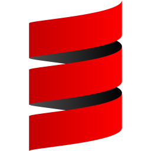

# Course Scala 

* [CURSO UTILIZADO](https://www.udemy.com/course/programacao-scala-orientacao-a-objetos-avancado/)

### Declaração de Variáveis
- val: imutável
- var: mutável

### Definição de Métodos

